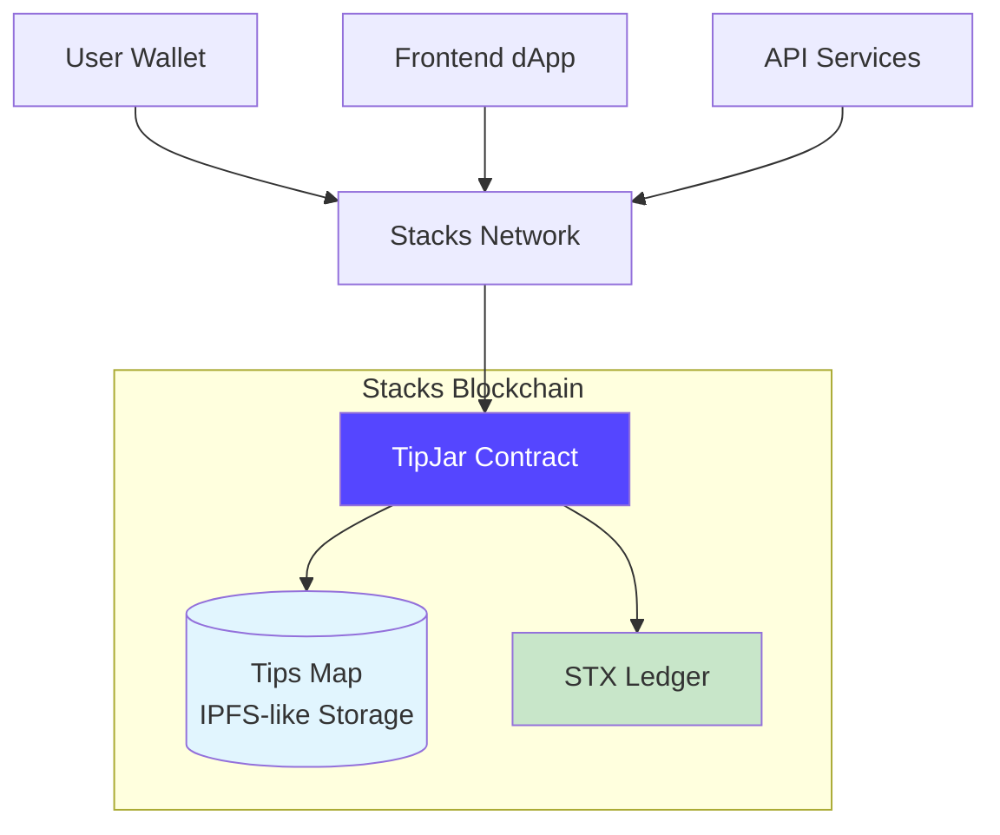
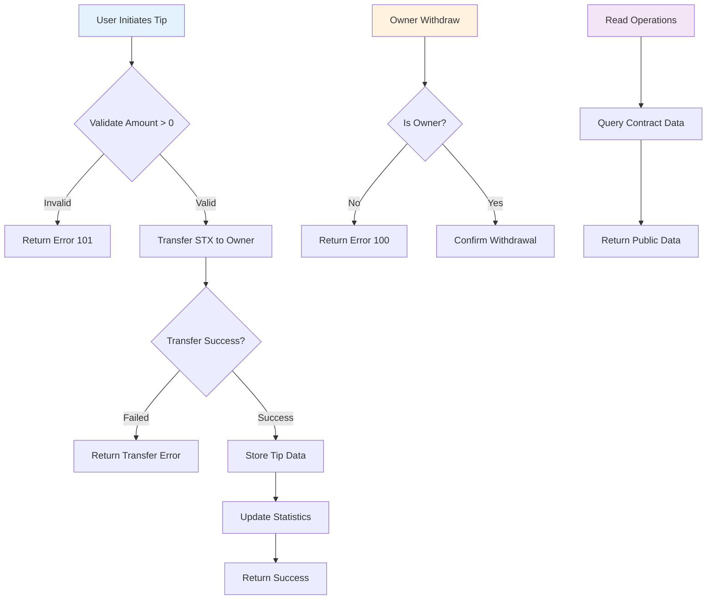
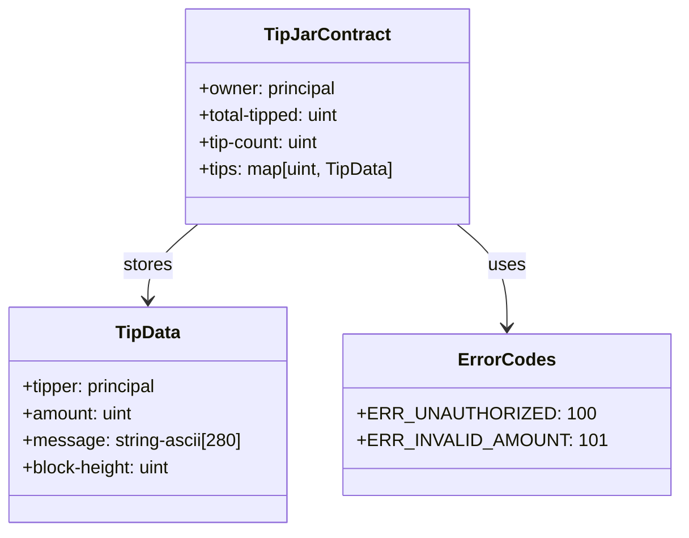

# TipJar

[](https://stacks.org)
[](https://clarity-lang.org)
[](https://explorer.stacks.co)
[](LICENSE)

> A decentralized stx tip jar smart contract built on the Stacks blockchain, enabling seamless STX tipping with personalized messages and transparent tracking.


## Table of Contents

- [TipJar](#tipjar)
  - [Table of Contents](#table-of-contents)
  - [Overview](#overview)
  - [Key Features](#key-features)
  - [Architecture](#architecture)
    - [System Architecture](#system-architecture)
    - [Contract Flow](#contract-flow)
    - [Data Model](#data-model)
  - [Quick Start](#quick-start)
    - [Prerequisites](#prerequisites)
    - [Installation](#installation)
    - [Local Development](#local-development)
  - [Contract Interface](#contract-interface)
    - [Public Functions](#public-functions)
      - [`tip(amount: uint, message: string-ascii[280]) → (response bool)`](#tipamount-uint-message-string-ascii280--response-bool)
      - [`withdraw() → (response bool)`](#withdraw--response-bool)
    - [Read-Only Functions](#read-only-functions)
      - [`get-total-tipped() → uint`](#get-total-tipped--uint)
      - [`get-tip-count() → uint`](#get-tip-count--uint)
      - [`get-tip(id: uint) → (optional TipData)`](#get-tipid-uint--optional-tipdata)
      - [`get-owner() → principal`](#get-owner--principal)
      - [`get-contract-balance() → uint`](#get-contract-balance--uint)
  - [Testing](#testing)
    - [Test Coverage](#test-coverage)
  - [Deployment](#deployment)
    - [Testnet Deployment](#testnet-deployment)
    - [Deploy to Mainnet](#deploy-to-mainnet)
  - [API Integration](#api-integration)
    - [JavaScript/TypeScript Example](#javascripttypescript-example)
    - [React Hook Example](#react-hook-example)
  - [Security](#security)
    - [Security Features](#security-features)
    - [Audit Status](#audit-status)
  - [Contributing](#contributing)
    - [Development Workflow](#development-workflow)
    - [Guidelines](#guidelines)
    - [Code Style](#code-style)
  - [Resources](#resources)
    - [Documentation](#documentation)
    - [Tools](#tools)
    - [Community](#community)
  - [License](#license)
  - [Acknowledgments](#acknowledgments)

## Overview

**TipJar** is a sophisticated smart contract deployed on the Stacks blockchain that revolutionizes digital tipping. Built with Clarity - Stacks' secure smart contract language - it provides a trustless, transparent, and efficient way for users to send STX (Stacks cryptocurrency) tips with personalized messages.

## Key Features

- **Instant Tipping**: Send STX tips with custom messages in real-time
- **Secure & Trustless**: Built on Stacks blockchain with cryptographic security
- **Transparent Tracking**: Complete history of all tips with immutable records
- **Owner Control**: Contract owner can manage and withdraw accumulated tips
- **Cross-Platform**: Works with any Stacks-compatible wallet or application
- **Frontend Ready**: Comprehensive API for seamless integration

## Architecture

### System Architecture



### Contract Flow



### Data Model



## Quick Start

### Prerequisites

- [Node.js](https://nodejs.org/) (v16 or higher)
- [Clarinet](https://github.com/hirosystems/clarinet) (v2.0+)
- [Stacks Wallet](https://wallet.stacks.org/) or compatible wallet

### Installation

```bash
# Clone the repository
git clone <repository-url>
cd tipjar-contract

# Install dependencies
npm install

# Run tests
npm test
```

### Local Development

```bash
# Start local development network
clarinet console

# Run contract checks
clarinet check

# Run tests in watch mode
npm run test:watch
```

## Contract Interface

### Public Functions

#### `tip(amount: uint, message: string-ascii[280]) → (response bool)`

Send a tip with STX and a personalized message.

**Parameters:**
- `amount`: Amount of STX to tip (in microSTX, minimum > 0)
- `message`: Custom message (max 280 ASCII characters)

**Returns:**
- `(ok true)` on success
- `(err u101)` if amount is invalid

**Example:**
```clarity
(contract-call? .tip-jar tip u1000000 "Thanks for the great work!")
```

#### `withdraw() → (response bool)`

Allows contract owner to withdraw accumulated tips. (Note: STX is transferred directly to owner on each tip)

**Returns:**
- `(ok true)` on success
- `(err u100)` if caller is not owner

### Read-Only Functions

#### `get-total-tipped() → uint`

Returns the total amount of STX tipped (in microSTX).

#### `get-tip-count() → uint`

Returns the total number of tips received.

#### `get-tip(id: uint) → (optional TipData)`

Returns tip data for a specific tip ID.

**Parameters:**
- `id`: Tip ID (0-based index)

**Returns:**
```clarity
{
  tipper: principal,
  amount: uint,
  message: string-ascii[280],
  block-height: uint
}
```

#### `get-owner() → principal`

Returns the contract owner's address.

#### `get-contract-balance() → uint`

Returns the contract's STX balance (always 0, as funds are transferred directly).

## Testing

```bash
# Run all tests
npm test

# Run tests with coverage
npm run test:coverage

# Run specific test file
npm test -- tests/tip-jar.test.ts
```

### Test Coverage

- Tip validation (amount > 0)
- STX transfer functionality
- Owner authorization
- Data persistence
- Error handling
- Read-only operations

## Deployment

### Testnet Deployment

The contract is currently deployed on Stacks Testnet:

- **Contract Address**: `STGDS0Y17973EN5TCHNHGJJ9B31XWQ5YXBQ0KQ2Y.tip-jar`
- **Transaction ID**: `8cb83b494a69c578905e7d2b2f24ee08ca64d0587fad2`
- **Explorer**: [View on Explorer](https://explorer.stacks.co/txid/8cb83b494a69c578905e7d2b2f24ee08ca64d0587fad2?chain=testnet)

### Deploy to Mainnet

```bash
# Generate mainnet deployment plan
clarinet deployments generate --mainnet --medium-cost

# Review the plan
cat deployments/default.mainnet-plan.yaml

# Apply deployment (requires funded mainnet account)
clarinet deployments apply --mainnet
```

## API Integration

### JavaScript/TypeScript Example

```typescript
import { StacksMainnet, StacksTestnet } from '@stacks/network';
import { callReadOnlyFunction, makeContractCall } from '@stacks/transactions';

// Initialize network
const network = new StacksTestnet();

// Get total tipped
const totalTipped = await callReadOnlyFunction({
  contractAddress: 'STGDS0Y17973EN5TCHNHGJJ9B31XWQ5YXBQ0KQ2Y',
  contractName: 'tip-jar',
  functionName: 'get-total-tipped',
  functionArgs: [],
  network,
  senderAddress: userAddress,
});

// Send a tip
const tipTx = await makeContractCall({
  contractAddress: 'STGDS0Y17973EN5TCHNHGJJ9B31XWQ5YXBQ0KQ2Y',
  contractName: 'tip-jar',
  functionName: 'tip',
  functionArgs: [
    uintCV(1000000), // 1 STX
    stringAsciiCV('Great work!'),
  ],
  network,
  senderKey: userPrivateKey,
});
```

### React Hook Example

```tsx
import { useSTXAddress } from '@stacks/connect-react';
import { useContractCall } from '@stacks/ui';

function TipJarComponent() {
  const stxAddress = useSTXAddress();

  const { handleContractCall } = useContractCall({
    contractAddress: 'STGDS0Y17973EN5TCHNHGJJ9B31XWQ5YXBQ0KQ2Y',
    contractName: 'tip-jar',
    functionName: 'tip',
    functionArgs: [uintCV(amount), stringAsciiCV(message)],
    onFinish: (data) => {
      console.log('Tip sent!', data);
    },
  });

  return (
    <button onClick={handleContractCall}>
      Send Tip
    </button>
  );
}
```

## Security

### Security Features

- **Input Validation**: All inputs are validated before processing
- **Access Control**: Only contract owner can withdraw
- **Immutable Records**: Tip history cannot be modified
- **Direct Transfers**: STX is transferred immediately to prevent contract risks

### Audit Status

This contract has been thoroughly tested and follows Clarity best practices. For production use, consider:

- Third-party security audit
- Formal verification
- Bug bounty program

## Contributing

We welcome contributions from the community! Here's how you can help:

### Development Workflow

1. **Fork** the repository
2. **Clone** your fork: `git clone https://github.com/your-username/tipjar.git`
3. **Create** a feature branch: `git checkout -b feature/amazing-feature`
4. **Install** dependencies: `npm install`
5. **Run tests**: `npm test`
6. **Make** your changes
7. **Test** thoroughly
8. **Commit** your changes: `git commit -m 'Add amazing feature'`
9. **Push** to the branch: `git push origin feature/amazing-feature`
10. **Open** a Pull Request

### Guidelines

- Follow the existing code style
- Add tests for new features
- Update documentation as needed
- Ensure all tests pass
- Use clear commit messages

### Code Style

- Use Clarity best practices
- Add comments for complex logic
- Follow naming conventions
- Keep functions focused and small

## Resources

### Documentation

- [Stacks Documentation](https://docs.stacks.co)
- [Clarity Language Reference](https://clarity-lang.org)
- [Clarinet Documentation](https://docs.hiro.so/clarinet)

### Tools

- [Stacks Explorer](https://explorer.stacks.co)
- [Clarinet](https://github.com/hirosystems/clarinet)
- [Stacks CLI](https://github.com/blockstack/cli)

### Community

- [Stacks Discord](https://discord.gg/stacks)
- [Stacks Forum](https://forum.stacks.org)
- [GitHub Discussions](https://github.com/your-repo/discussions)

## License

This project is licensed under the MIT License - see the [LICENSE](LICENSE) file for details.

## Acknowledgments

- Built on the [Stacks](https://stacks.org) blockchain
- Thanks to the Stacks community for their support
- Inspired by the need for transparent digital tipping

---

<div align="center">

**Built with Clarity on Stacks** • **Secure** • **Transparent** • **Decentralized**

[Star us on GitHub](https://github.com/your-repo) • [Report Issues](https://github.com/your-repo/issues) • [Join Discussions](https://github.com/your-repo/discussions)

</div>